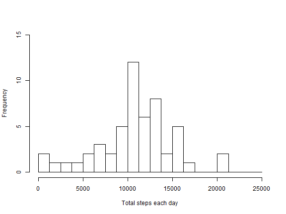
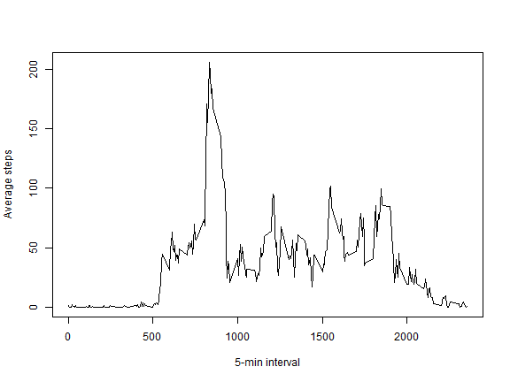
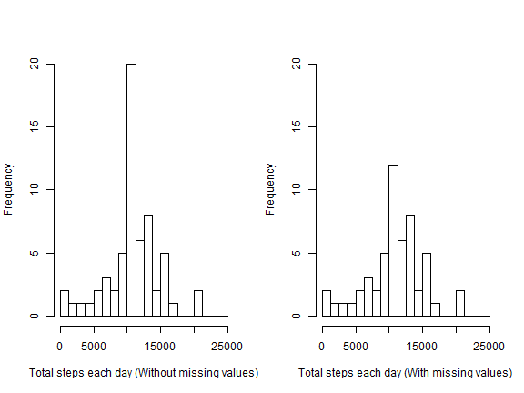
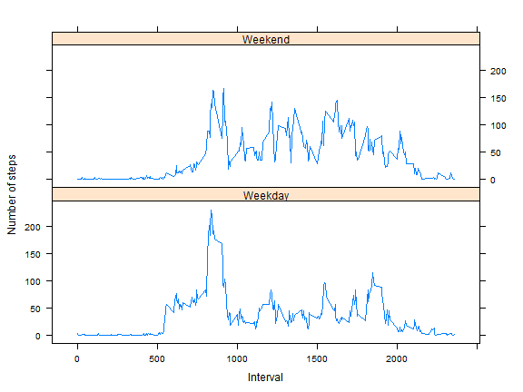

# Reproducible Research: Peer Assessment 1


Last updated on Sun Jan 18 14:21:03 2015 by Sarah Huang

***

<span style="color:blue">For the introduction of this project, please see README.md</span>

## Loading and preprocessing the data

This project requires the knitr and the lattice packages. Make sure they are loaded.


```r
unzip("activity.zip")
activity <- read.csv("activity.csv") 
activity <- activity[, c(2,3,1)] #reorder columns
```

Here is the data structure.

```r
str(activity)
```

```
## 'data.frame':	17568 obs. of  3 variables:
##  $ date    : Factor w/ 61 levels "2012-10-01","2012-10-02",..: 1 1 1 1 1 1 1 1 1 1 ...
##  $ interval: int  0 5 10 15 20 25 30 35 40 45 ...
##  $ steps   : int  NA NA NA NA NA NA NA NA NA NA ...
```

Here is what the dataset looks.

```r
head(activity)
```

```
##         date interval steps
## 1 2012-10-01        0    NA
## 2 2012-10-01        5    NA
## 3 2012-10-01       10    NA
## 4 2012-10-01       15    NA
## 5 2012-10-01       20    NA
## 6 2012-10-01       25    NA
```

## What is mean total number of steps taken per day?

Calculate and report the mean and median total number of steps taken per day.

```r
stepsPerDay <- aggregate(steps ~ date, data = activity, FUN= "sum")
head(stepsPerDay, 10)
```

```
##          date steps
## 1  2012-10-02   126
## 2  2012-10-03 11352
## 3  2012-10-04 12116
## 4  2012-10-05 13294
## 5  2012-10-06 15420
## 6  2012-10-07 11015
## 7  2012-10-09 12811
## 8  2012-10-10  9900
## 9  2012-10-11 10304
## 10 2012-10-12 17382
```


```r
summary(stepsPerDay$steps, digits=5)
```

```
##    Min. 1st Qu.  Median    Mean 3rd Qu.    Max. 
##      41    8841   10765   10766   13294   21194
```

Note that the mean and the median are almost the identical and this indicates the data is evenly distributed around the mean.

Make a histogram of the total number of steps taken each day.

```r
hist(stepsPerDay$steps, xlab = "Total steps each day", main = "", breaks=seq(0, 25000, by=1250), ylim = c(0, 15))
```

 

## What is the average daily activity pattern?

Make a time series plot of the 5-minute interval and the average number of steps taken, averaged across all days.

```r
aveStepsPerInterval <- aggregate(steps ~ interval, data = activity, FUN= "mean")
colnames(aveStepsPerInterval)[2] <- "averageSteps" #modify column names
head(aveStepsPerInterval, 10)
```

```
##    interval averageSteps
## 1         0      1.71698
## 2         5      0.33962
## 3        10      0.13208
## 4        15      0.15094
## 5        20      0.07547
## 6        25      2.09434
## 7        30      0.52830
## 8        35      0.86792
## 9        40      0.00000
## 10       45      1.47170
```

```r
with(aveStepsPerInterval, {
  plot(interval, averageSteps, type = "l", xlab = "5-min interval", ylab = "Average steps", main = "")
  })
```

 

Find out which 5-minute interval, on average across all the days in the dataset, contains the maximum number of steps.

```r
with(aveStepsPerInterval, {
  i <- which(averageSteps == max(averageSteps))
  aveStepsPerInterval[i, ]
  })
```

```
##     interval averageSteps
## 104      835        206.2
```

## Imputing missing values

Note that there are a number of days/intervals where there are missing values (coded as NA).

Calculate and report the total number of missing values in the dataset.

```r
sapply(activity, function(x) sum(is.na(x)))
```

```
##     date interval    steps 
##        0        0     2304
```

Fill in all of the missing values in the dataset by using the mean for the corresponding 5-minute interval across all days. This will create a new dataset, names as "activityNew".

```r
activityNew <- merge(activity, aveStepsPerInterval, by="interval", all=TRUE)
activityNew <- activityNew[with(activityNew, order(date)), ] #sort the new dataset by date
row.names(activityNew) <- NULL #remove row names
activityNew <- activityNew[, c(2,1,3,4)] #reorder columns
head(activityNew, 10)
```

```
##          date interval steps averageSteps
## 1  2012-10-01        0    NA      1.71698
## 2  2012-10-01        5    NA      0.33962
## 3  2012-10-01       10    NA      0.13208
## 4  2012-10-01       15    NA      0.15094
## 5  2012-10-01       20    NA      0.07547
## 6  2012-10-01       25    NA      2.09434
## 7  2012-10-01       30    NA      0.52830
## 8  2012-10-01       35    NA      0.86792
## 9  2012-10-01       40    NA      0.00000
## 10 2012-10-01       45    NA      1.47170
```

```r
activityNew$steps[is.na(activityNew$steps)] <- activityNew$averageSteps[is.na(activityNew$steps)] #replace the missing values
activityNew$averageSteps <- NULL #remove column "aveSteps"
head(activityNew, 10)
```

```
##          date interval   steps
## 1  2012-10-01        0 1.71698
## 2  2012-10-01        5 0.33962
## 3  2012-10-01       10 0.13208
## 4  2012-10-01       15 0.15094
## 5  2012-10-01       20 0.07547
## 6  2012-10-01       25 2.09434
## 7  2012-10-01       30 0.52830
## 8  2012-10-01       35 0.86792
## 9  2012-10-01       40 0.00000
## 10 2012-10-01       45 1.47170
```

Make a histogram of the total number of steps taken each day and compare to the original dataset with missing values (refer to the first figure). Both figures are shown side by side below for comparison.


```r
stepsPerDayNew <- aggregate(steps ~ date, data = activityNew, FUN= "sum")
head(stepsPerDayNew, 10)
```

```
##          date steps
## 1  2012-10-01 10766
## 2  2012-10-02   126
## 3  2012-10-03 11352
## 4  2012-10-04 12116
## 5  2012-10-05 13294
## 6  2012-10-06 15420
## 7  2012-10-07 11015
## 8  2012-10-08 10766
## 9  2012-10-09 12811
## 10 2012-10-10  9900
```

```r
par(mfrow = c(1, 2))
hist(stepsPerDayNew$steps, xlab = "Total steps each day (Without missing values)", main = "", breaks=seq(0, 25000, by=1250), ylim = c(0, 20))
hist(stepsPerDay$steps, xlab = "Total steps each day (With missing values)", main = "", breaks=seq(0, 25000, by=1250), ylim = c(0, 20))
```

 

Calculate and report the mean and median total number of steps taken per day and compare with the original dataset. Do these values differ from the estimates from the first part of the assignment? What is the impact of imputing missing data on the estimates of the total daily number of steps?


```r
summary(stepsPerDayNew$steps, digits=5)
```

```
##    Min. 1st Qu.  Median    Mean 3rd Qu.    Max. 
##      41    9819   10766   10766   12811   21194
```

By examine the above figures and numbers, we can conclude that the summary statistics (mean and median, etc.) of the new dataset does not differ much from that of the original dataset. By imputing missing data using the adopted strategy, we add a couple days of missing data which are the mean of the total daily number of steps. This does not alter the characteristic of the data.   

## Are there differences in activity patterns between weekdays and weekends?

Create a new factor variable in the dataset with two levels - "weekday" and "weekend" indicating whether a given date is a weekday or weekend day.


```r
activityNew$date.type <- weekdays(as.Date(activityNew$date))
weekdays <- c("Monday", "Tuesday", "Wednesday", "Thursday", "Friday")
activityNew$date.type <- ifelse(activityNew$date.type %in% weekdays, "Weekday", "Weekend")
activityNew$date.type <- as.factor(activityNew$date.type)
head(activityNew)
```

```
##         date interval   steps date.type
## 1 2012-10-01        0 1.71698   Weekday
## 2 2012-10-01        5 0.33962   Weekday
## 3 2012-10-01       10 0.13208   Weekday
## 4 2012-10-01       15 0.15094   Weekday
## 5 2012-10-01       20 0.07547   Weekday
## 6 2012-10-01       25 2.09434   Weekday
```

Make a panel plot containing a time series plot of the 5-minute interval (x-axis) and the average number of steps taken, averaged across all weekday days or weekend days (y-axis). 


```r
aveStepsPerIntervalNew <- aggregate(steps ~ interval + date.type, data = activityNew, FUN= "mean")
colnames(aveStepsPerIntervalNew)[3] <- "averageSteps"
head(aveStepsPerIntervalNew, 10)
```

```
##    interval date.type averageSteps
## 1         0   Weekday      2.25115
## 2         5   Weekday      0.44528
## 3        10   Weekday      0.17317
## 4        15   Weekday      0.19790
## 5        20   Weekday      0.09895
## 6        25   Weekday      1.59036
## 7        30   Weekday      0.69266
## 8        35   Weekday      1.13795
## 9        40   Weekday      0.00000
## 10       45   Weekday      1.79623
```


```r
xyplot(averageSteps ~ interval | date.type, data = aveStepsPerIntervalNew, type = "l", ylab = "Number of steps", xlab = "Interval", layout = c(1,2))
```

 

As seen in the figure above, people get up earlier on weekdays and are more active in the mornings than weekends. Peak activity values are seen during mid-day lunch hours on both weekdays and weekends with higher value seen on weekdays. Lunch starts later during weekends. Higher activity values are observed throughout afternoons and evenings on weekends than weekdays. People go to bed later on weekends. 
